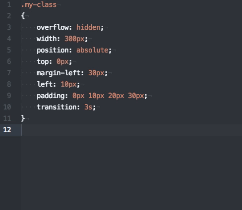

# CSSComb

A [CSS-beautifier utility](http://csscomb.com/) which will ensure that your SCSS is consistent with our [code style](https://github.com/mobify/mobify-code-style/blob/develop/css/.csscomb.json).



## How to Install CSSComb

### Prerequisites
* Install Node.js and NPM with NVM as directed in the [Adaptive.js docs](http://adaptivejs.mobify.com/v2.0/docs/install/)
* Install CSSComb and the Mobify Code Style:

   `npm install -g csscomb mobify-code-style`

### Atom
1. Install [css-comb package](https://atom.io/packages/css-comb) for Atom (this will allow you to set the global CSSComb config)
1. Open your Atom package settings for "css-comb" (**not** "csscomb")
  * Ensure your custom config path is set to your machine's version of `mobify-code-style`: Run `npm config get prefix` and append `/lib/node_modules/mobify-code-style/css/.csscomb.json` to the result
  * Ensure Disable config searching is unchecked
1. Restart Atom
1. Start combing your Sass!

### Sublime Text

Before you start, make sure you have [Package Control](https://packagecontrol.io/installation) installed for Sublime Text.

1. Install [CSSComb for Sublime](https://packagecontrol.io/packages/CSScomb) (Search for "CSScomb" in Sublime's Package Control)
1. CSSComb for Sublime will look for your config in your HOME directory, so make a symlink to the Mobify Code Style version (this way, updating the code style through NPM will automagically update the config for Sublime):

  ```bash
  cd ~
  ln -s /path/to/your/local/node_modules/mobify-code-style/css/.csscomb.json ./.csscomb.json
  ```
  (Find your local path by running `npm config get prefix` and append `/lib/node_modules/mobify-code-style/css/.csscomb.json` to the result)
1. Restart Sublime
1. Start combing your Sass!

### Other Text Editors

* [CSSComb for VIM](https://github.com/csscomb/vim-csscomb)
* [jetbrains-csscomb](https://github.com/csscomb/jetbrains-csscomb) which should work for all JetBrains IDEs, such as IDEA, PyCharm, WebStorm, PhpStorm, RubyMine, and perhaps others.
* [CSSComb for Emacs](https://github.com/channikhabra/css-comb.el), including Aquamacs
