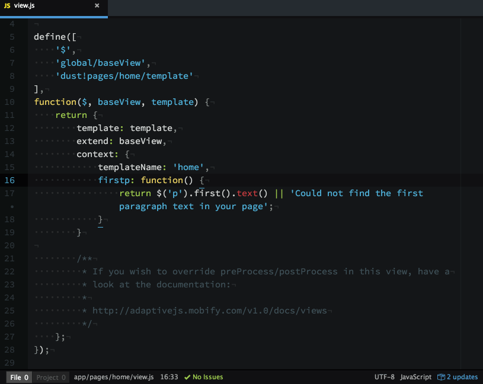
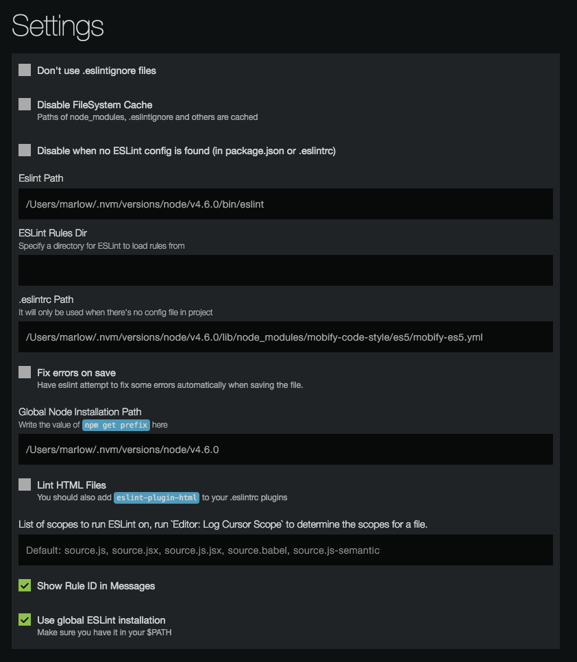

# ESLint and Atom Text



Instead of relying on your project's linting tasks (`grunt lint` or `npm run lint`), wouldn't it be better to have Atom proactively linting your JS as you compose it, using Mobify's code style as a ruleset? Here's how!

## Prerequisites

1. Install Node.js and NPM with [NVM](https://github.com/creationix/nvm)
1. Install eslint and Mobify's code style globally:
```bash
npm install -g eslint
npm install -g mobify-code-style
```

## Instructions for Atom

1. Install the [linter package](https://atom.io/packages/linter)
1. Install the [linter-eslint package](https://atom.io/packages/linter-eslint)
1. Open your Atom package settings for `linter-eslint` and ensure:
    * Your `ESLint Path` is set
        * Find your ESLint path by running `which eslint` in a terminal
    * Your `.eslintrc Path` is set to the ES5 config file from Mobify's code style
        * This config is the fallback for when an existing ESLint config does not exist in the current project
    * Your `Global Node Installation Path` is set
        * Find this by running `npm get prefix` in a terminal

Your Atom settings will look something like this:


Now restart Atom and open a JS file to see it in action.

*Tip*: When working on a project that does not need to conform to this code style,
toggle the linter off/on by opening the command palette with <kbd>shift</kbd>+<kbd>⌘</kbd>+<kbd>p</kbd> (Mac) or <kbd>shift</kbd>+<kbd>ctrl</kbd>+<kbd>p</kbd> (PC) and type + select `Linter: Toggle`
